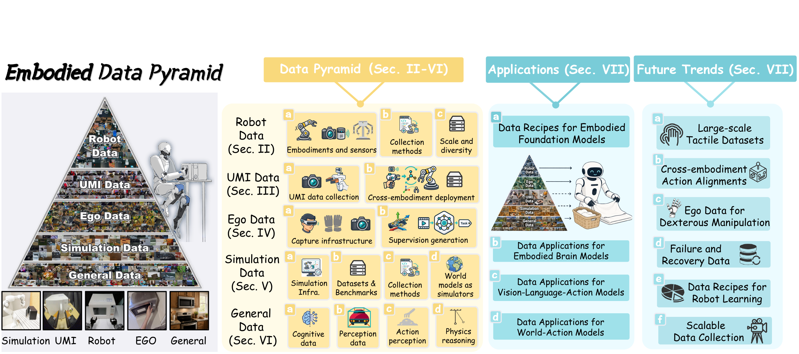

# Awesome Embodied Data  

  

This repository accompanies a survey on the **data pyramid** for robotics and embodied AI. It curates the datasets, data-collection paradigms, simulators, and data-hungry model families reviewed in the survey — spanning **real-robot data**, **UMI (in-the-wild) data**, **simulation data**, **egocentric / ego-exo human data**, and broad **general (web-scale) data** — together with the **VLA / world-action / embodied-VLM** models that consume them. Each entry links to its paper, project page, and code where available.

> If you have suggestions for new resources, improvements to methodologies, or corrections for broken links, please don't hesitate to open an issue or submit a pull request. Contributions of all kinds are welcome and greatly appreciated.

## Table of Contents

**Data Sources:** [Real-Robot](#real-robot-data) · [UMI](#umi-data) · [Simulation](#simulation-data) · [Ego/Ego-Exo](#egocentric-ego-exo-data) · [General](#general-data)

**Model Families:** [VLA](#vision-language-action-vla-models) · [WAM](#world-action-models-wam) · [Embodied VLM](#embodied-vision-language-models-vlm)

**Challenges:** [Cross-Embodiment State](#cross-embodiment-state) · [Dexterous Ego Priors](#egocentric-priors-for-dexterous-hands) · [Failure & Recovery](#failure-recovery-centric-learning) · [Data Recipe](#data-recipe)

**Community:** [Contributing](#contributing)

## The Data Pyramid: Data Sources

### Real-Robot Data

| Year | Dataset | Paper | Scale | Venue | Project | Repo@GitHub |
|------|---------|-------|-------|-------|---------|-------------|
| 2026 | AgiBot World 2026 | AgiBot World 2026: Real-World Embodied Intelligence Dataset |  |  |  |  |
| 2026 | DECO-50 | [DECO: Decoupled Multimodal Diffusion Transformer for Bimanual Dexterous Manipulation with a Plugin Tactile Adapter](https://arxiv.org/abs/2602.05513) | 8K trajectories | ICML |  |  |
| 2026 | Dexora | [Dexora: Open-source VLA for High-DoF Bimanual Dexterity](https://arxiv.org/abs/2605.18722) | 12.2K trajectories | ICRA |  |  |
| 2026 | HapTile | [HapTile: A Haptic-Informed Vision-Tactile-Language-Action Dataset for Contact-Rich Imitation Learning](https://arxiv.org/abs/2606.04825) | 1.7K trajectories |  |  |  |
| 2026 | LET-Base-Dataset | LET-Base-Dataset: LET Basic Operation Dataset | 92.6K trajectories |  |  |  |
| 2026 | MolmoAct2-BimanualYAM  | [MolmoAct2: Action Reasoning Models for Real-world Deployment](https://arxiv.org/abs/2605.02881) | 34.5K trajectories |  |  |  |
| 2026 | MolmoAct2-SO100/101  | [MolmoAct2: Action Reasoning Models for Real-world Deployment](https://arxiv.org/abs/2605.02881) | 38K trajectories |  |  |  |
| 2026 | OmniViTac | [OmniVTA: Visuo-Tactile World Modeling for Contact-Rich Robotic Manipulation](https://arxiv.org/abs/2603.19201) | 21.9K trajectories |  |  |  |
| 2026 | Open-H-Embodiment | [Open-H-Embodiment: A Large-Scale Dataset for Enabling Foundation Models in Medical Robotics](https://arxiv.org/abs/2604.21017) | 125.8K trajectories |  |  |  |
| 2026 | Baihu-VTouch | [VTouch++: A Multimodal Dataset with Vision-Based Tactile Enhancement for Bimanual Manipulation](https://arxiv.org/abs/2604.20444) |  |  |  |  |
| 2026 | Unitree UnifoLM-WBT | UniFoLM-WBT-Dataset |  |  |  |  |
| 2025 | Aist-Bimanual | AIST Bimanual Manipulation Dataset | 10.7K trajectories |  |  |  |
| 2025 | PH2D | [Humanoid Policy ~ Human Policy](https://arxiv.org/abs/2503.13441) | 1.6K trajectories | CORL |  |  |
| 2025 | ActionNet | ActionNet: A Dataset for Dexterous Bimanual Manipulation | 30K trajectories |  |  |  |
| 2025 | AgiBot World Beta | [AgiBot World Colosseo: A Large-scale Manipulation Platform for Scalable and Intelligent Embodied Systems](https://arxiv.org/abs/2503.06669) | 1M trajectories | IROS |  |  |
| 2025 | Open Galaxea | [Galaxea Open-World Dataset and G0 Dual-System VLA Model](https://arxiv.org/abs/2509.00576) | 100K trajectories |  |  |  |
| 2025 | Humanoid Everyday | [Humanoid Everyday: A Comprehensive Robotic Dataset for Open-World Humanoid Manipulation](https://arxiv.org/abs/2510.08807) | 10.3K trajectories |  |  |  |
| 2025 | MotionTrans | [MotionTrans: Human VR Data Enable Motion-Level Learning for Robotic Manipulation Policies](https://arxiv.org/abs/2509.17759) | 1.5K trajectories | ICRA |  |  |
| 2025 | RealSource-World | RealSource-World: A Large-Scale Real-World Dual-Arm Manipulation Dataset | 11.4K trajectories |  |  |  |
| 2025 | REASSEMBLE | [REASSEMBLE: A Multimodal Dataset for Contact-rich Robotic Assembly and Disassembly](https://arxiv.org/abs/2502.05086) | 4.6K trajectories | RSS |  |  |
| 2025 | RoboCOIN | [RoboCOIN: An Open-Sourced Bimanual Robotic Data Collection for Integrated Manipulation](https://arxiv.org/abs/2511.17441) | 180K trajectories |  |  |  |
| 2025 | RoboMIND 2.0 | [RoboMIND 2.0: A Multimodal, Bimanual Mobile Manipulation Dataset for Generalizable Embodied Intelligence](https://arxiv.org/abs/2512.24653) | 310K trajectories |  |  |  |

More entries (2024 and earlier)

| Year | Dataset | Paper | Scale | Venue | Project | Repo@GitHub |
|------|---------|-------|-------|-------|---------|-------------|
| 2024 | FMB | [FMB: a Functional Manipulation Benchmark for Generalizable Robotic Learning](https://arxiv.org/abs/2401.08553) | 22.6K trajectories |  |  |  |
| 2024 | ALOHA Unleashed | [ALOHA Unleashed: A Simple Recipe for Robot Dexterity](https://arxiv.org/abs/2410.13126) | 26.2K trajectories | CoRL |  |  |
| 2024 | DROID | [DROID: A Large-Scale In-The-Wild Robot Manipulation Dataset](https://arxiv.org/abs/2403.12945) | 76K trajectories | RSS |  |  |
| 2024 | HumanPlus | [HumanPlus: Humanoid Shadowing and Imitation from Humans](https://arxiv.org/abs/2406.10454) | 240 trajectories | CoRL |  |  |
| 2024 | Mobile ALOHA | [Mobile ALOHA: Learning Bimanual Mobile Manipulation with Low-Cost Whole-Body Teleoperation](https://arxiv.org/abs/2401.02117) | 276 trajectories | CORL |  |  |
| 2024 | OmniH2O | [OmniH2O: Universal and Dexterous Human-to-Humanoid Whole-Body Teleoperation and Learning](https://arxiv.org/abs/2406.08858) |  | CoRL |  |  |
| 2024 | Open X-Embodiment | [Open X-Embodiment: Robotic Learning Datasets and RT-X Models](https://arxiv.org/abs/2310.08864) | 2.4M trajectories | ICRA |  |  |
| 2024 | RoboMIND | [RoboMIND: Benchmark on Multi-embodiment Intelligence Normative Data for Robot Manipulation](https://arxiv.org/abs/2412.13877) | 107K trajectories | RSS |  |  |
| 2023 | ALOHA | [Learning Fine-Grained Bimanual Manipulation with Low-Cost Hardware](https://arxiv.org/abs/2304.13705) | 300 trajectories | RSS |  |  |
| 2023 | RH20T | [RH20T: A Comprehensive Robotic Dataset for Learning Diverse Skills in One-Shot](https://arxiv.org/abs/2307.00595) | 110K trajectories | ICRA |  |  |
| 2023 | RoboSet | [RoboAgent: Generalization and Efficiency in Robot Manipulation via Semantic Augmentations and Action Chunking](https://arxiv.org/abs/2309.01918) | 98.5K trajectories | ICRA |  |  |
| 2023 | BridgeData V2 | [BridgeData V2: A Dataset for Robot Learning at Scale](https://arxiv.org/abs/2308.12952) | 60.1K trajectories | CoRL |  |  |
| 2023 | FurnitureBench | [FurnitureBench: Reproducible Real-World Benchmark for Long-Horizon Complex Manipulation](https://arxiv.org/abs/2305.12821) | 5.1K trajectories | RSS |  |  |
| 2022 | BC-Z | [BC-Z: Zero-Shot Task Generalization with Robotic Imitation Learning](https://arxiv.org/abs/2202.02005) | 26K trajectories | CoRL |  |  |
| 2022 | RT-1 | [RT-1: Robotics Transformer for Real-World Control at Scale](https://arxiv.org/abs/2212.06817) | 130K trajectories | RSS |  |  |
| 2021 | MT-Opt | [MT-Opt: Continuous Multi-Task Robotic Reinforcement Learning at Scale](https://arxiv.org/abs/2104.08212) | 800K trajectories | CoRL |  |  |
| 2021 | BridgeData | [Bridge Data: Boosting Generalization of Robotic Skills with Cross-Domain Datasets](https://arxiv.org/abs/2109.13396) | 7.2K trajectories | RSS |  |  |
| 2019 | RoboNet | [RoboNet: Large-Scale Multi-Robot Learning](https://arxiv.org/abs/1910.11215) | 162K trajectories | CoRL |  |  |
| 2018 | DAML | [One-Shot Imitation from Observing Humans via Domain-Adaptive Meta-Learning](https://arxiv.org/abs/1802.01557) | 2.9K trajectories | RSS |  |  |
| 2018 | MIME | [Multiple Interactions Made Easy (MIME): Large Scale Demonstrations Data for Imitation](https://arxiv.org/abs/1810.07121) | 8.3K trajectories | CoRL |  |  |
| 2018 | QT-Opt | [QT-Opt: Scalable Deep Reinforcement Learning for Vision-Based Robotic Manipulation](https://arxiv.org/abs/1806.10293) | 580K trajectories | CoRL |  |  |
| 2018 | RoboTurk | [RoboTurk: A Crowdsourcing Platform for Robotic Skill Learning through Imitation](https://arxiv.org/abs/1811.02790) | 2.1K trajectories | CoRL |  |  |
| 2015 | Pinto and Gupta | [Supersizing Self-supervision: Learning to Grasp from 50K Tries and 700 Robot Hours](https://arxiv.org/abs/1509.06825) | 50K trajectories | ICRA |  |  |

### UMI Data

| Year | Dataset | Paper | Scale | Venue | Project | Repo@GitHub |
|------|---------|-------|-------|-------|---------|-------------|
| 2026 | HuMI | [Humanoid Manipulation Interface: Humanoid Whole-Body Manipulation from Robot-Free Demonstrations](https://arxiv.org/abs/2602.06643) | 827 trajectories |  |  |  |
| 2026 | RealOmni | RealOmni-Open DataSet | 789773 tranjectories |  |  |  |
| 2026 | UMI-3D | [UMI-3D: Extending Universal Manipulation Interface from Vision-Limited to 3D Spatial Perception](https://arxiv.org/abs/2604.14089) | 4609 trajectories |  |  |  |
| 2026 | TAMEn | [TAMEn: Tactile-Aware Manipulation Engine for Closed-Loop Data Collection in Contact-Rich Tasks](https://arxiv.org/abs/2604.07335) | 724 trajectories |  |  |  |
| 2026 | Daimon-Infinity | Daimon-Infinity | 274669 trajectories |  |  |  |
| 2025 | Data Scaling Laws | [Data Scaling Laws in Imitation Learning for Robotic Manipulation](https://arxiv.org/abs/2410.18647) | 24098 trajectories | ICLR |  |  |
| 2025 | LEGATO | [LEGATO: Cross-Embodiment Imitation Using a Grasping Tool](https://arxiv.org/abs/2411.03682) | 900 tranjectories | RAL |  |  |
| 2025 | ViTaMIn | [ViTaMIn: Learning Contact-Rich Tasks Through Robot-Free Visuo-Tactile Manipulation Interface](https://arxiv.org/abs/2504.06156) | 841 trajectories |  |  |  |
| 2025 | DexWild | [DexWild: Dexterous Human Interactions for In-the-Wild Robot Policies](https://arxiv.org/abs/2505.07813) | 9505 trajectories | RSS |  |  |
| 2025 | DexUMI | [DexUMI: Using Human Hand as the Universal Manipulation Interface for Dexterous Manipulation](https://arxiv.org/abs/2505.21864) | 1792 trajectories | CoRL |  |  |
| 2025 | FreeTacMan | [FreeTacMan: Robot-free Visuo-Tactile Data Collection System for Contact-rich Manipulation](https://arxiv.org/abs/2506.01941) | 10000 trajectories | ICRA |  |  |
| 2025 | Touch in the Wild | [Touch in the Wild: Learning Fine-Grained Manipulation with a Portable Visuo-Tactile Gripper](https://arxiv.org/abs/2507.15062) | 2737 trajectories | NeurIPS |  |  |
| 2025 | exUMI | [exUMI: Extensible Robot Teaching System with Action-aware Task-agnostic Tactile Representation](https://arxiv.org/abs/2509.14688) | 1660 trajectories | CoRL |  |  |
| 2025 | MV-UMI | [MV-UMI: A Scalable Multi-View Interface for Cross-Embodiment Learning](https://arxiv.org/abs/2509.18757) | 1370 trajectories |  |  |  |
| 2025 | ManipForce | [ManipForce: Force-Guided Policy Learning with Frequency-Aware Representation for Contact-Rich Manipulation](https://arxiv.org/abs/2509.19047) | 597 trajectories | ICRA |  |  |
| 2025 | FastUMI-100K | [FastUMI-100K: Advancing Data-driven Robotic Manipulation with a Large-scale UMI-style Dataset](https://arxiv.org/abs/2510.08022) | 100K trajectories |  |  |  |
| 2025 | ViTaMIn-B | [ViTaMIn-B: A Reliable and Efficient Visuo-Tactile Bimanual Manipulation Interface](https://arxiv.org/abs/2511.05858) | 884 trajectories |  |  |  |
| 2024 | UMI | [Universal Manipulation Interface: In-The-Wild Robot Teaching Without In-The-Wild Robots](https://arxiv.org/abs/2402.10329) | 2543 trajectories | RSS |  |  |
| 2024 | ManiWAV | [ManiWAV: Learning Robot Manipulation from In-the-Wild Audio-Visual Data](https://arxiv.org/abs/2406.19464) | 1014 trajectories | CoRL |  |  |
| 2024 | UMI-on-Legs | [UMI on Legs: Making Manipulation Policies Mobile with Manipulation-Centric Whole-body Controllers](https://openreview.net/forum?id=3i7j8ZPnbm) | 514 trajectories | CoRL |  |  |
| 2024 | Fast-UMI | [Fast-UMI: A Scalable and Hardware-Independent Universal Manipulation Interface](https://arxiv.org/abs/2409.19499) | 8965 trajectories | CORL |  |  |

### Simulation Data

> **Curation note.** For peer-reviewed work, `Year` and `Publication / Type` use the formal publication year and venue. For arXiv-only work, `Year` is the first public preprint year. Software without a canonical paper is labeled `Software`. The sections below distinguish reusable 3D/scene assets, simulation backends, evaluation benchmarks, and both downloadable synthetic datasets and systems that generate such data.

#### 3D Assets & Scene Datasets

| Year | Resource / Acronym | Reference | Publication / Type | Project | Official Code |
|------|---------|-------|-------|---------|-------------|
| 2026 | ManiTwin-100K | [ManiTwin: Scaling Data-Generation-Ready Digital Object Dataset to 100K](https://arxiv.org/abs/2603.16866) | arXiv |  |  |
| 2026 | PhysX-Mobility (dataset) | [PhysX-Anything: Simulation-Ready Physical 3D Assets from Single Image](https://arxiv.org/abs/2511.13648) | CVPR |  |  |
| 2026 | PhysXVerse (dataset) | [PhysX-Omni: Unified Simulation-Ready Physical 3D Generation for Rigid, Deformable, and Articulated Objects](https://arxiv.org/abs/2605.21572) | arXiv |  |  |
| 2025 | PhysXNet & PhysXNet-XL | [PhysX-3D: Physical-Grounded 3D Asset Generation](https://arxiv.org/abs/2507.12465) | NeurIPS |  |  |
| 2024 | HSSD-200 | [Habitat Synthetic Scenes Dataset (HSSD-200): An Analysis of 3D Scene Scale and Realism Tradeoffs for ObjectGoal Navigation](https://arxiv.org/abs/2306.11290) | CVPR |  |  |
| 2023 | Objaverse | [Objaverse: A Universe of Annotated 3D Objects](https://arxiv.org/abs/2212.08051) | CVPR |  |  |
| 2023 | Objaverse-XL | [Objaverse-XL: A Universe of 10M+ 3D Objects](https://arxiv.org/abs/2307.05663) | NeurIPS |  |  |
| 2023 | OmniObject3D | [OmniObject3D: Large-Vocabulary 3D Object Dataset for Realistic Perception, Reconstruction and Generation](https://arxiv.org/abs/2301.07525) | CVPR |  |  |
| 2023 | ScanNet++ | [ScanNet++: A High-Fidelity Dataset of 3D Indoor Scenes](https://arxiv.org/abs/2308.11417) | ICCV |  |  |
| 2022 | ABO | [ABO: Dataset and Benchmarks for Real-World 3D Object Understanding](https://arxiv.org/abs/2110.06199) | CVPR |  |  |
| 2022 | GSO | [Google Scanned Objects: A High-Quality Dataset of 3D Scanned Household Items](https://arxiv.org/abs/2204.11918) | ICRA |  |  |
| 2022 | ObjectFolder 2.0 | [ObjectFolder 2.0: A Multisensory Object Dataset for Sim2Real Transfer](https://arxiv.org/abs/2204.02389) | CVPR |  |  |
| 2022 | ProcTHOR | [ProcTHOR: Large-Scale Embodied AI Using Procedural Generation](https://arxiv.org/abs/2206.06994) | NeurIPS |  |  |
| 2021 | 3D-FRONT | [3D-FRONT: 3D Furnished Rooms with layOuts and semaNTics](https://arxiv.org/abs/2011.09127) | ICCV |  |  |
| 2021 | HM3D | [Habitat-Matterport 3D Dataset (HM3D): 1000 Large-scale 3D Environments for Embodied AI](https://arxiv.org/abs/2109.08238) | NeurIPS |  |  |
| 2019 | Replica | [The Replica Dataset: A Digital Replica of Indoor Spaces](https://arxiv.org/abs/1906.05797) | arXiv |  |  |
| 2017 | Matterport3D | [Matterport3D: Learning from RGB-D Data in Indoor Environments](https://arxiv.org/abs/1709.06158) | 3DV |  |  |
| 2015 | ShapeNet | [ShapeNet: An Information-Rich 3D Model Repository](https://arxiv.org/abs/1512.03012) | arXiv |  |  |

#### Simulation & Rendering Backends

| Year | Resource / Acronym | Reference | Publication / Type | Project | Official Code |
|------|---------|-------|-------|---------|-------------|
| 2026 | Genie Sim 3.0 | [Genie Sim 3.0: A High-Fidelity Comprehensive Simulation Platform for Humanoid Robot](https://arxiv.org/abs/2601.02078) | arXiv |  |  |
| 2026 | Tac2Real | [Tac2Real: Reliable and GPU Visuotactile Simulation for Online Reinforcement Learning and Zero-Shot Real-World Deployment](https://arxiv.org/abs/2603.28475) | arXiv |  |  |
| 2026 | UniVTAC | [UniVTAC: A Unified Simulation Platform for Visuo-Tactile Manipulation Data Generation, Learning, and Benchmarking](https://arxiv.org/abs/2602.10093) | arXiv |  |  |
| 2025 | GenManip | [GenManip: LLM-driven Simulation for Generalizable Instruction-Following Manipulation](https://arxiv.org/abs/2506.10966) | CVPR |  |  |
| 2025 | NVIDIA Isaac Sim | [Official software documentation](https://developer.nvidia.com/isaac/sim) | Software (open-source repository released in 2025) |  |  |
| 2025 | ManiSkill3 | [ManiSkill3: GPU Parallelized Robotics Simulation and Rendering for Generalizable Embodied AI](https://arxiv.org/abs/2410.00425) | RSS |  |  |
| 2025 | Newton | [Open-source GPU-accelerated physics engine for robotics](https://newton-physics.github.io/newton/) | Software |  |  |
| 2025 | RoboVerse | [RoboVerse: Towards a Unified Platform, Dataset and Benchmark for Scalable and Generalizable Robot Learning](https://arxiv.org/abs/2504.18904) | arXiv |  |  |
| 2025 | Taccel | [Taccel: Scaling Up Vision-based Tactile Robotics via High-performance GPU Simulation](https://arxiv.org/abs/2504.12908) | NeurIPS |  |  |
| 2025 | TacFlex | [TacFlex: Multimode Tactile Imprints Simulation for Visuotactile Sensors With Coating Patterns](https://ieeexplore.ieee.org/document/11024236) | T-RO |  |  |
| 2025 | TacSL | [TacSL: A Library for Visuotactile Sensor Simulation and Learning](https://arxiv.org/abs/2408.06506) | T-RO |  |  |
| 2024 | DiffTactile | [DiffTactile: A Physics-based Differentiable Tactile Simulator for Contact-rich Robotic Manipulation](https://arxiv.org/abs/2403.08716) | ICLR |  |  |
| 2024 | Genesis | [Generative and universal physics engine for robotics and beyond](https://genesis-embodied-ai.github.io/) | Software |  |  |
| 2024 | Habitat 3.0 | [Habitat 3.0: A Co-Habitat for Humans, Avatars and Robots](https://arxiv.org/abs/2310.13724) | ICLR |  |  |
| 2024 | TacEx | [TacEx: GelSight Tactile Simulation in Isaac Sim -- Combining Soft-Body and Visuotactile Simulators](https://arxiv.org/abs/2411.04776) | CoRL 2024 Workshop / arXiv |  |  |
| 2023 | Orbit | [Orbit: A Unified Simulation Framework for Interactive Robot Learning Environments](https://arxiv.org/abs/2301.04195) | RA-L |  |  |
| 2023 | RoboHive | [RoboHive: A Unified Framework for Robot Learning](https://arxiv.org/abs/2310.06828) | NeurIPS |  |  |
| 2023 | Tacchi | [Tacchi: A Pluggable and Low Computational Cost Elastomer Deformation Simulator for Optical Tactile Sensors](https://arxiv.org/abs/2301.08343) | RA-L |  |  |
| 2022 | Tactile Gym 2.0 | [Tactile Gym 2.0: Sim-to-Real Deep Reinforcement Learning for Comparing Low-Cost High-Resolution Robot Touch](https://arxiv.org/abs/2207.10763) | RA-L |  |  |
| 2022 | Tacto | [TACTO: A Fast, Flexible, and Open-Source Simulator for High-Resolution Vision-Based Tactile Sensors](https://arxiv.org/abs/2012.08456) | RA-L |  |  |
| 2022 | Taxim | [Taxim: An Example-based Simulation Model for GelSight Tactile Sensors](https://arxiv.org/abs/2109.04027) | RA-L |  |  |
| 2021 | Brax | [Brax -- A Differentiable Physics Engine for Large Scale Rigid Body Simulation](https://arxiv.org/abs/2106.13281) | NeurIPS |  |  |
| 2021 | Habitat 2.0 | [Habitat 2.0: Training Home Assistants to Rearrange their Habitat](https://arxiv.org/abs/2106.14405) | NeurIPS |  |  |
| 2021 | Isaac Gym | [Isaac Gym: High Performance GPU-Based Physics Simulation For Robot Learning](https://arxiv.org/abs/2108.10470) | NeurIPS |  |  |
| 2016 | PyBullet | [PyBullet](https://github.com/bulletphysics/bullet3#pybullet) | Software (official citation: 2016--2021) |  |  |
| 2021 | ThreeDWorld (TDW) | [ThreeDWorld: A Platform for Interactive Multi-Modal Physical Simulation](https://arxiv.org/abs/2007.04954) | NeurIPS |  |  |
| 2020 | SAPIEN | [SAPIEN: A SimulAted Part-based Interactive ENvironment](https://arxiv.org/abs/2003.08515) | CVPR |  |  |
| 2019 | PyRep | [PyRep: Bringing V-REP to Deep Robot Learning](https://arxiv.org/abs/1906.11176) | arXiv |  |  |
| 2013 | V-REP (now CoppeliaSim) | [V-REP: A Versatile and Scalable Robot Simulation Framework](https://doi.org/10.1109/IROS.2013.6696520) | IROS |  |  |
| 2012 | MuJoCo | [MuJoCo: A physics engine for model-based control](https://ieeexplore.ieee.org/document/6386109) | IROS |  |  |

#### Benchmarks

| Year | Resource / Acronym | Reference | Publication / Type | Project | Official Code |
|------|---------|-------|-------|---------|-------------|
| 2026 | BiCoord | [BiCoord: A Bimanual Manipulation Benchmark towards Long-Horizon Spatial-Temporal Coordination](https://arxiv.org/abs/2604.05831) | arXiv |  |  |
| 2026 | DuoBench | [DuoBench: A Reproducible Benchmark for Bimanual Manipulation in Simulation and the Real World](https://arxiv.org/abs/2606.11901) | arXiv |  |  |
| 2026 | MIKASA | [Memory, Benchmark & Robots: A Benchmark for Solving Complex Tasks with Reinforcement Learning](https://arxiv.org/abs/2502.10550) | ICLR |  |  |
| 2026 | REALM | [REALM: A Real-to-Sim Validated Benchmark for Generalization in Robotic Manipulation](https://arxiv.org/abs/2512.19562) | RA-L |  |  |
| 2026 | RMBench | [RMBench: Memory-Dependent Robotic Manipulation Benchmark with Insights into Policy Design](https://arxiv.org/abs/2603.01229) | arXiv |  |  |
| 2026 | RoboCasa365 | [RoboCasa365: A Large-Scale Simulation Framework for Training and Benchmarking Generalist Robots](https://arxiv.org/abs/2603.04356) | ICLR |  |  |
| 2026 | RoboDojo | [RoboDojo: A Unified Sim-and-Real Benchmark for Comprehensive Evaluation of Generalist Robot Manipulation Policies](https://arxiv.org/abs/2607.04434) | arXiv |  |  |
| 2026 | RoboMemArena | [RoboMemArena: A Comprehensive and Challenging Robotic Memory Benchmark](https://arxiv.org/abs/2605.10921) | arXiv |  |  |
| 2026 | RoboMME | [RoboMME: Benchmarking and Understanding Memory for Robotic Generalist Policies](https://arxiv.org/abs/2603.04639) | ICML |  |  |
| 2026 | RobotArena ∞ | [RobotArena ∞: Scalable Robot Benchmarking via Real-to-Sim Translation](https://arxiv.org/abs/2510.23571) | ICLR |  |  |
| 2025 | ManiSkill-HAB | [ManiSkill-HAB: A Benchmark for Low-Level Manipulation in Home Rearrangement Tasks](https://arxiv.org/abs/2412.13211) | ICLR |  |  |
| 2025 | MuJoCo Playground | [MuJoCo Playground](https://arxiv.org/abs/2502.08844) | arXiv |  |  |
| 2025 | RoboCerebra | [RoboCerebra: A Large-scale Benchmark for Long-horizon Robotic Manipulation Evaluation](https://arxiv.org/abs/2506.06677) | NeurIPS |  |  |
| 2025 | RoboEval | [RoboEval: Where Robotic Manipulation Meets Structured and Scalable Evaluation](https://arxiv.org/abs/2507.00435) | arXiv |  |  |
| 2025 | RoboTwin 2.0 | [RoboTwin 2.0: A Scalable Data Generator and Benchmark with Strong Domain Randomization for Robust Bimanual Robotic Manipulation](https://arxiv.org/abs/2506.18088) | arXiv |  |  |
| 2025 | VLABench | [VLABench: A Large-Scale Benchmark for Language-Conditioned Robotics Manipulation with Long-Horizon Reasoning Tasks](https://arxiv.org/abs/2412.18194) | ICCV |  |  |
| 2024 | BEHAVIOR-1K | [BEHAVIOR-1K: A Human-Centered, Embodied AI Benchmark with 1,000 Everyday Activities and Realistic Simulation](https://arxiv.org/abs/2403.09227) | arXiv |  |  |
| 2024 | BiGym | [BiGym: A Demo-Driven Mobile Bi-Manual Manipulation Benchmark](https://arxiv.org/abs/2407.07788) | CoRL |  |  |
| 2024 | GarmentLab | [GarmentLab: A Unified Simulation and Benchmark for Garment Manipulation](https://arxiv.org/abs/2411.01200) | NeurIPS |  |  |
| 2024 | HumanoidBench | [HumanoidBench: Simulated Humanoid Benchmark for Whole-Body Locomotion and Manipulation](https://arxiv.org/abs/2403.10506) | RSS |  |  |
| 2024 | ManiSkill-ViTac 2025 | [ManiSkill-ViTac 2025: Challenge on Manipulation Skill Learning With Vision and Tactile Sensing](https://arxiv.org/abs/2411.12503) | arXiv |  |  |
| 2024 | RoboCasa | [RoboCasa: Large-Scale Simulation of Everyday Tasks for Generalist Robots](https://arxiv.org/abs/2406.02523) | RSS |  |  |
| 2024 | RoboTwin | [RoboTwin: Dual-Arm Robot Benchmark with Generative Digital Twins (early version)](https://arxiv.org/abs/2409.02920) | ECCV Workshop |  |  |
| 2024 | SIMPLER | [Evaluating Real-World Robot Manipulation Policies in Simulation](https://arxiv.org/abs/2405.05941) | CoRL |  |  |
| 2024 | THE COLOSSEUM | [THE COLOSSEUM: A Benchmark for Evaluating Generalization for Robotic Manipulation](https://arxiv.org/abs/2402.08191) | RSS |  |  |
| 2023 | ARNOLD | [ARNOLD: A Benchmark for Language-Grounded Task Learning With Continuous States in Realistic 3D Scenes](https://arxiv.org/abs/2304.04321) | ICCV |  |  |
| 2023 | DaXBench | [DaXBench: Benchmarking Deformable Object Manipulation with Differentiable Physics](https://arxiv.org/abs/2210.13066) | ICLR |  |  |
| 2023 | DexArt | [DexArt: Benchmarking Generalizable Dexterous Manipulation with Articulated Objects](https://arxiv.org/abs/2305.05706) | CVPR |  |  |
| 2023 | LIBERO | [LIBERO: Benchmarking Knowledge Transfer for Lifelong Robot Learning](https://arxiv.org/abs/2306.03310) | NeurIPS |  |  |
| 2023 | ManiSkill2 | [ManiSkill2: A Unified Benchmark for Generalizable Manipulation Skills](https://arxiv.org/abs/2302.04659) | ICLR |  |  |
| 2023 | VIMA | [VIMA: General Robot Manipulation with Multimodal Prompts](https://arxiv.org/abs/2210.03094) | ICML |  |  |
| 2022 | Bi-DexHands | [Towards Human-Level Bimanual Dexterous Manipulation with Reinforcement Learning](https://arxiv.org/abs/2206.08686) | NeurIPS |  |  |
| 2022 | CALVIN | [CALVIN: A Benchmark for Language-Conditioned Policy Learning for Long-Horizon Robot Manipulation Tasks](https://arxiv.org/abs/2112.03227) | RA-L |  |  |
| 2021 | PlasticineLab | [PlasticineLab: A Soft-Body Manipulation Benchmark with Differentiable Physics](https://arxiv.org/abs/2104.03311) | ICLR |  |  |
| 2020 | RLBench | [RLBench: The Robot Learning Benchmark & Learning Environment](https://arxiv.org/abs/1909.12271) | RA-L |  |  |
| 2020 | SoftGym | [SoftGym: Benchmarking Deep Reinforcement Learning for Deformable Object Manipulation](https://arxiv.org/abs/2011.07215) | CoRL |  |  |
| 2019 | Meta-World | [Meta-World: A Benchmark and Evaluation for Multi-Task and Meta Reinforcement Learning](https://arxiv.org/abs/1910.10897) | CoRL |  |  |

#### Simulation/Synthetic Datasets & Data-Generation Systems

| Year | Resource / Acronym | Reference | Publication / Type | Project | Official Code |
|------|---------|-------|-------|---------|-------------|
| 2026 | MolmoB0T data | [MolmoB0T: Large-Scale Simulation Enables Zero-Shot Manipulation](https://arxiv.org/abs/2603.16861) | arXiv / simulation dataset |  |  |
| 2025 | Dex1B | [Dex1B: Learning with 1B Demonstrations for Dexterous Manipulation](https://arxiv.org/abs/2506.17198) | RSS / dataset |  |  |
| 2025 | DexMimicGen | [DexMimicGen: Automated Data Generation for Bimanual Dexterous Manipulation via Imitation Learning](https://arxiv.org/abs/2410.24185) | ICRA / data-generation system |  |  |
| 2025 | DreamGen | [DreamGen: Unlocking Generalization in Robot Learning through Video World Models](https://arxiv.org/abs/2505.12705) | CoRL / world-model-generated data |  |  |
| 2025 | GR00T-X-Embodiment-Sim | [GR00T N1: An Open Foundation Model for Generalist Humanoid Robots](https://arxiv.org/abs/2503.14734) | arXiv / simulation dataset |  |  |
| 2025 | InternData-A1 | [InternData-A1: Pioneering High-Fidelity Synthetic Data for Pre-training Generalist Policy](https://arxiv.org/abs/2511.16651) | arXiv / synthetic dataset |  |  |
| 2025 | SynGrasp-1B | [GraspVLA: a Grasping Foundation Model Pre-trained on Billion-scale Synthetic Action Data](https://arxiv.org/abs/2505.03233) | arXiv / synthetic dataset |  |  |
| 2024 | GenSim | [GenSim: Generating Robotic Simulation Tasks via Large Language Models](https://arxiv.org/abs/2310.01361) | ICLR / task-generation system |  |  |
| 2024 | GenSim2 | [GenSim2: Scaling Robot Data Generation with Multi-modal and Reasoning LLMs](https://arxiv.org/abs/2410.03645) | CoRL / data-generation framework |  |  |
| 2024 | RoboGen | [RoboGen: Towards Unleashing Infinite Data for Automated Robot Learning via Generative Simulation](https://arxiv.org/abs/2311.01455) | ICML / generative simulation system |  |  |
| 2023 | DexGraspNet | [DexGraspNet: A Large-Scale Robotic Dexterous Grasp Dataset for General Objects Based on Simulation](https://arxiv.org/abs/2210.02697) | ICRA / dataset |  |  |
| 2023 | MimicGen | [MimicGen: A Data Generation System for Scalable Robot Learning using Human Demonstrations](https://arxiv.org/abs/2310.17596) | CoRL / data-generation system |  |  |
| 2021 | ACRONYM | [ACRONYM: A Large-Scale Grasp Dataset Based on Simulation](https://arxiv.org/abs/2011.09584) | ICRA / dataset |  |  |
| 2021 | robomimic | [What Matters in Learning from Offline Human Demonstrations for Robot Manipulation](https://arxiv.org/abs/2108.03298) | CoRL / framework & simulated human demonstrations |  |  |

#### World Models as Simulators

| Year | Acronym | Paper | Venue | Project | Repo@GitHub |
|------|---------|-------|-------|---------|-------------|
| 2026 |  | [World Model for Robot Learning: A Comprehensive Survey](https://arxiv.org/abs/2605.00080) | arXiv |  |  |
| 2026 | GigaBrain-0.5M* | [GigaBrain-0.5M*: a VLA That Learns From World Model-Based Reinforcement Learning](https://arxiv.org/abs/2602.12099) | arXiv |  |  |
| 2026 | PlayWorld | [PlayWorld: Learning Robot World Models from Autonomous Play](https://arxiv.org/abs/2603.09030) | arXiv |  |  |
| 2026 | RehearseVLA | [RehearseVLA: Simulated Post-Training for VLAs with Physically-Consistent World Model](https://openaccess.thecvf.com/content/CVPR2026/html/Xiao_RehearseVLA_Simulated_Post-Training_for_VLAs_with_Physically-Consistent_World_Model_CVPR_2026_paper.html) | CVPR |  |  |
| 2026 | RISE | [RISE: Self-Improving Robot Policy with Compositional World Model](https://arxiv.org/abs/2602.11075) | arXiv |  |  |
| 2026 | WMPO | [WMPO: World Model-based Policy Optimization for Vision-Language-Action Models](https://arxiv.org/abs/2511.09515) | ICLR |  |  |
| 2026 | World-Gymnast | [World-Gymnast: Training Robots with Reinforcement Learning in a World Model](https://arxiv.org/abs/2602.02454) | arXiv |  |  |
| 2025 |  | [A Survey of Sim-to-Real Methods in RL: Progress, Prospects and Challenges with Foundation Models](https://arxiv.org/abs/2502.13187) | arXiv |  |  |
| 2025 |  | [Evaluating Gemini Robotics Policies in a Veo World Simulator](https://arxiv.org/abs/2512.10675) | arXiv |  |  |
| 2025 | DiWA | [DiWA: Diffusion Policy Adaptation with World Models](https://arxiv.org/abs/2508.03645) | CoRL |  |  |
| 2025 | DreamGen | [DreamGen: Unlocking Generalization in Robot Learning through Video World Models](https://arxiv.org/abs/2505.12705) | CoRL |  |  |
| 2025 | GigaWorld-0 | [GigaWorld-0: World Models as Data Engine to Empower Embodied AI](https://arxiv.org/abs/2511.19861) | arXiv |  |  |
| 2025 | ProphRL | [Reinforcing Action Policies by Prophesying](https://arxiv.org/abs/2511.20633) | arXiv |  |  |
| 2025 | VLA-RFT | [VLA-RFT: Vision-Language-Action Reinforcement Fine-tuning with Verified Rewards in World Simulators](https://arxiv.org/abs/2510.00406) | arXiv |  |  |
| 2025 | World-Env | [World-Env: Leveraging World Model as a Virtual Environment for VLA Post-Training](https://arxiv.org/abs/2509.24948) | arXiv |  |  |
| 2025 | World4RL | [World4RL: Diffusion World Models for Policy Refinement with Reinforcement Learning for Robotic Manipulation](https://arxiv.org/abs/2509.19080) | arXiv |  |  |
| 2025 | WorldEval | [WorldEval: World Model as Real-World Robot Policies Evaluator](https://arxiv.org/abs/2505.19017) | arXiv |  |  |
| 2025 | WorldGym | [WorldGym: World Model as An Environment for Policy Evaluation](https://arxiv.org/abs/2506.00613) | arXiv |  |  |
| 2024 | 3DFF | [Sim-to-Real Transfer via 3D Feature Fields for Vision-and-Language Navigation](https://arxiv.org/abs/2406.09798) | CoRL |  |  |
| 2024 | UniSim | [Learning Interactive Real-World Simulators](https://arxiv.org/abs/2310.06114) | ICLR |  |  |
| 2023 | DayDreamer | [DayDreamer: World Models for Physical Robot Learning](https://arxiv.org/abs/2206.14176) | CoRL |  |  |
| 2023 | DreamerV3 | [Mastering Diverse Domains through World Models](https://arxiv.org/abs/2301.04104) | arXiv |  |  |
| 2020 | Dreamer | [Dream to Control: Learning Behaviors by Latent Imagination](https://arxiv.org/abs/1912.01603) | ICLR |  |  |
| 2019 | PlaNet | [Learning Latent Dynamics for Planning from Pixels](https://arxiv.org/abs/1811.04551) | ICML |  |  |
| 2018 | World Models | [Recurrent World Models Facilitate Policy Evolution](https://arxiv.org/abs/1809.01999) | NeurIPS |  |  |
| 2016 |  | [DeepMind Lab](https://arxiv.org/abs/1612.03801) | arXiv |  |  |

### Egocentric & Ego-Exo Data

| Year | Acronym | Paper | Venue | Project | Repo@GitHub |
|------|---------|-------|-------|---------|-------------|
| 2026 | ChildLens | [ChildLens: An egocentric video dataset for activity analysis in children](https://link.springer.com/article/10.3758/s13428-026-02982-6) |  |  |  |
| 2026 | Ego-1K | [Ego-1K -- A Large-Scale Multiview Video Dataset for Egocentric Vision](https://arxiv.org/abs/2603.13741) | arXiv |  |  |
| 2026 | EgoDex | [EgoDex: Learning Dexterous Manipulation from Large-Scale Egocentric Video](https://arxiv.org/abs/2505.11709) | arXiv |  |  |
| 2026 | EgoEMG | [EgoEMG: A Multimodal Egocentric Dataset with Bilateral EMG and Vision for Hand Pose Estimation](https://arxiv.org/abs/2605.05712) | arXiv |  |  |
| 2026 | EgoEV-HandPose | [EgoEV-HandPose: Egocentric 3D Hand Pose Estimation and Gesture Recognition with Stereo Event Cameras](https://arxiv.org/abs/2605.12297) | arXiv |  |  |
| 2026 | EgoLive | [EgoLive: A Large-Scale Egocentric Dataset from Real-World Human Tasks](https://arxiv.org/abs/2604.23570) | arXiv |  |  |
| 2026 | EgoMAGIC | [EgoMAGIC: An Egocentric Video Field Medicine Dataset for Training Perception Algorithms](https://arxiv.org/abs/2604.22036) | arXiv |  |  |
| 2026 | EgoTraj | [EgoTraj: Real-World Egocentric Human Trajectory Dataset for Multimodal Prediction](https://arxiv.org/abs/2605.19004) | arXiv |  |  |
| 2026 | EgoVerse | [EgoVerse: An Egocentric Human Dataset for Robot Learning from Around the World](https://arxiv.org/abs/2604.07607) | arXiv |  |  |
| 2026 | FEEL | [FEEL (Force-Enhanced Egocentric Learning): A Dataset for Physical Action Understanding](https://arxiv.org/abs/2603.15847) | arXiv |  |  |
| 2026 | H-RDT | [H-RDT: Human Manipulation Enhanced Bimanual Robotic Manipulation](https://arxiv.org/abs/2507.23523) | AAAI |  |  |
| 2026 | TouchAnything | [TouchAnything: A Dataset and Framework for Bimanual Tactile Estimation from Egocentric Video](https://arxiv.org/abs/2605.13083) | arXiv |  |  |
| 2026 | Xperience-10M | Xperience-10M: Ropedia Dataset Release |  |  |  |
| 2025 | Ego-Exo4D | [Ego-Exo4D: Understanding Skilled Human Activity from First- and Third-Person Perspectives](https://arxiv.org/abs/2311.18259) |  |  |  |
| 2025 | EgoLife | [EgoLife: Towards Egocentric Life Assistant](https://arxiv.org/abs/2503.03803) | CVPR |  |  |
| 2025 | EgoMe | [EgoMe: A New Dataset and Challenge for Following Me via Egocentric View in Real World](https://arxiv.org/abs/2501.19061) | arXiv |  |  |
| 2025 | EgoMimic | [EgoMimic: Scaling Imitation Learning via Egocentric Video](https://arxiv.org/abs/2410.24221) | ICRA |  |  |
| 2025 | HD-EPIC | [HD-EPIC: A Highly-Detailed Egocentric Video Dataset](https://arxiv.org/abs/2502.04144) | CVPR |  |  |
| 2025 | IndEgo | [IndEgo: A Dataset of Industrial Scenarios and Collaborative Work for Egocentric Assistants](https://arxiv.org/abs/2511.19684) | NeurIPS |  |  |
| 2025 | OpenEgo | [OpenEgo: A Large-Scale Multimodal Egocentric Dataset for Dexterous Manipulation](https://arxiv.org/abs/2509.05513) | arXiv |  |  |
| 2025 | TASTE-Rob | [TASTE-Rob: Advancing Video Generation of Task-Oriented Hand-Object Interaction for Generalizable Robotic Manipulation](https://arxiv.org/abs/2503.11423) | CVPR |  |  |

More entries (2024 and earlier)

| Year | Acronym | Paper | Venue | Project | Repo@GitHub |
|------|---------|-------|-------|---------|-------------|
| 2024 | CaptainCook4D | [CaptainCook4D: A Dataset for Understanding Errors in Procedural Activities](https://arxiv.org/abs/2312.14556) | NeurIPS |  |  |
| 2024 | EgoExo-Fitness | [EgoExo-Fitness: Towards Egocentric and Exocentric Full-Body Action Understanding](https://arxiv.org/abs/2406.08877) | ECCV |  |  |
| 2024 | EgoExoLearn | [EgoExoLearn: A Dataset for Bridging Asynchronous Ego- and Exo-centric View of Procedural Activities in Real World](https://arxiv.org/abs/2403.16182) | CVPR |  |  |
| 2024 | EgoSurgery-Phase | [EgoSurgery-Phase: A Dataset of Surgical Phase Recognition from Egocentric Open Surgery Videos](https://arxiv.org/abs/2405.19644) |  |  |  |
| 2024 | HOT3D | [Introducing HOT3D: An Egocentric Dataset for 3D Hand and Object Tracking](https://arxiv.org/abs/2406.09598) | arXiv |  |  |
| 2024 | IndustReal | [IndustReal: A Dataset for Procedure Step Recognition Handling Execution Errors in Egocentric Videos in an Industrial-Like Setting](https://arxiv.org/abs/2310.17323) | WACV |  |  |
| 2024 | Nymeria | [Nymeria: A Massive Collection of Multimodal Egocentric Daily Motion in the Wild](https://arxiv.org/abs/2406.09905) | ECCV |  |  |
| 2024 | WEAR | [WEAR: An Outdoor Sports Dataset for Wearable and Egocentric Activity Recognition](https://arxiv.org/abs/2304.05088) |  |  |  |
| 2023 | ARCTIC | [ARCTIC: A Dataset for Dexterous Bimanual Hand-Object Manipulation](https://arxiv.org/abs/2204.13662) | CVPR |  |  |
| 2023 | AssemblyHands | [AssemblyHands: Towards Egocentric Activity Understanding via 3D Hand Pose Estimation](https://arxiv.org/abs/2304.12301) | CVPR |  |  |
| 2023 | ENIGMA-51 | [ENIGMA-51: Towards a Fine-Grained Understanding of Human-Object Interactions in Industrial Scenarios](https://arxiv.org/abs/2309.14809) | arXiv |  |  |
| 2023 | HoloAssist | [HoloAssist: an Egocentric Human Interaction Dataset for Interactive AI Assistants in the Real World](https://arxiv.org/abs/2309.17024) | ICCV |  |  |
| 2022 | Assembly101 | [Assembly101: A Large-Scale Multi-View Video Dataset for Understanding Procedural Activities](https://arxiv.org/abs/2203.14712) | CVPR |  |  |
| 2022 | HOI4D | [HOI4D: A 4D Egocentric Dataset for Category-Level Human-Object Interaction](https://arxiv.org/abs/2203.01577) | CVPR |  |  |
| 2022 | Touch and Go | [Touch and Go: Learning from Human-Collected Vision and Touch](https://arxiv.org/abs/2211.12498) | NeurIPS |  |  |
| 2021 | EPIC-KITCHENS-100 | [Rescaling Egocentric Vision: Collection, Pipeline and Challenges for EPIC-KITCHENS-100](https://arxiv.org/abs/2006.13256) | arXiv |  |  |
| 2021 | H2O | [H2O: Two Hands Manipulating Objects for First Person Interaction Recognition](https://arxiv.org/abs/2104.11181) | ICCV |  |  |
| 2018 |  | [First-Person Hand Action Benchmark with RGB-D Videos and 3D Hand Pose Annotations](https://openaccess.thecvf.com/content_cvpr_2018/html/Garcia-Hernando_First-Person_Hand_Action_CVPR_2018_paper.html) | CVPR |  |  |
| 2018 | Charades-Ego | [Charades-Ego: A Large-Scale Dataset of Paired Third and First Person Videos](https://arxiv.org/abs/1804.09626) | arXiv |  |  |
| 2018 | EGTEA Gaze+ | [In the Eye of the Beholder: Gaze and Actions in First Person Video](https://arxiv.org/abs/2006.00626) | ECCV |  |  |
| 2018 | EPIC-KITCHENS | [Scaling Egocentric Vision: The EPIC-KITCHENS Dataset](https://arxiv.org/abs/1804.02748) | arXiv |  |  |
| 2017 | Charades-STA | [TALL: Temporal Activity Localization via Language Query (Charades-STA dataset)](https://arxiv.org/abs/1705.02101) |  |  |  |
| 2017 | THU-READ | [Action Recognition in RGB-D Egocentric Videos](https://ieeexplore.ieee.org/document/8296915) |  |  |  |
| 2016 | EgoConvNet | [First Person Action Recognition Using Deep Learned Descriptors](https://openaccess.thecvf.com/content_cvpr_2016/html/Singh_First_Person_Action_CVPR_2016_paper.html) | CVPR |  |  |
| 2015 | Ego-Deliver | [Ego-Deliver: A Large-Scale Dataset for Egocentric Video Analysis](https://dl.acm.org/doi/10.1145/3474085.3475336) |  |  |  |
| 2015 | EgoHands | [Lending A Hand: Detecting Hands and Recognizing Activities in Complex Egocentric Interactions](https://openaccess.thecvf.com/content_iccv_2015/html/Bambach_Lending_A_Hand_ICCV_2015_paper.html) | ICCV |  |  |

### General Data

#### Visual Data

| Year | Acronym | Paper | Venue | Project | Repo@GitHub |
|------|---------|-------|-------|---------|-------------|
| 2025 | FiRE | [FiRE: Enhancing MLLMs with Fine-Grained Context Learning for Complex Image Retrieval](https://dl.acm.org/doi/10.1145/3726302.3729979) |  |  |  |
| 2025 | RoboAfford++ | [RoboAfford++: A Generative AI-Enhanced Dataset for Multimodal Affordance Learning in Robotic Manipulation and Navigation](https://arxiv.org/abs/2511.12436) |  |  |  |
| 2024 | LLaVA-OneVision-SI | [LLaVA-OneVision: Easy Visual Task Transfer](https://arxiv.org/abs/2408.03326) |  |  |  |
| 2024 | LLaVA-Video-178K | [LLaVA-Video-178K: Video Instruction Tuning With Synthetic Data](https://arxiv.org/abs/2410.02713) |  |  |  |
| 2024 | MultiUI | [Harnessing Webpage UIs for Text-Rich Visual Understanding](https://arxiv.org/abs/2410.13824) |  |  |  |
| 2024 | PixMo | [Molmo and PixMo: Open Weights and Open Data for State-of-the-Art Vision-Language Models](https://arxiv.org/abs/2409.17146) |  |  |  |
| 2024 | PixMo-Points | [PixMo-Points](https://arxiv.org/abs/2409.17146) |  |  |  |
| 2024 | RoboPoint | [RoboPoint: A Vision-Language Model for Spatial Affordance Prediction for Robotics](https://arxiv.org/abs/2406.10721) |  |  |  |
| 2023 | PACO-LVIS | [PACO: Parts and Attributes of Common Objects](https://arxiv.org/abs/2301.01795) |  |  |  |
| 2023 | SA-1B | [Segment Anything (SA-1B dataset)](https://arxiv.org/abs/2304.02643) |  |  |  |
| 2023 | ShareGPT4V | [ShareGPT4V: Improving Large Multi-Modal Models with Better Captions](https://arxiv.org/abs/2311.12793) |  |  |  |
| 2022 | ChartQA | [ChartQA: A Benchmark for Question Answering about Charts with Visual and Logical Reasoning](https://arxiv.org/abs/2203.10244) |  |  |  |
| 2021 | Ego4D NLQ | [Ego4D: Around the World in 3,000 Hours of Egocentric Video](https://arxiv.org/abs/2110.07058) |  |  |  |
| 2021 | TextOCR | [TextOCR: Towards Large-Scale End-to-End Reasoning for Arbitrary-Shaped Scene Text](https://arxiv.org/abs/2105.05486) |  |  |  |
| 2020 | DocVQA | [DocVQA: A Dataset for VQA on Document Images](https://arxiv.org/abs/2007.00398) |  |  |  |
| 2017 | Visual Genome | [Visual Genome: Connecting Language and Vision Using Crowdsourced Dense Image Annotations](https://arxiv.org/abs/1602.07332) |  |  |  |
| 2016 | ADE20K | [Semantic Understanding of Scenes through the ADE20K Dataset](https://arxiv.org/abs/1608.05442) |  |  |  |
| 2016 | RefCOCO | [Modeling Context in Referring Expressions](https://arxiv.org/abs/1608.00272) |  |  |  |
| 2015 | VQA | [VQA: Visual Question Answering](https://arxiv.org/abs/1505.00468) | ICCV |  |  |
| 2014 | COCO | [Microsoft COCO: Common Objects in Context](https://arxiv.org/abs/1405.0312) | ECCV |  |  |
|  | Objects365 | [Objects365: A Large-Scale, High-Quality Dataset for Object Detection](https://ieeexplore.ieee.org/document/9009553) |  |  |  |

#### Segmentation & Localization

| Year | Acronym | Paper | Venue | Project | Repo@GitHub |
|------|---------|-------|-------|---------|-------------|
| 2025 | PTG-FSCIR | [Pseudo-triplet Guided Few-shot Composed Image Retrieval](https://arxiv.org/abs/2407.06001) |  |  |  |
| 2024 | MMScan | [MMScan: A Multi-Modal 3D Scene Dataset with Hierarchical Grounded Language Annotations](https://arxiv.org/abs/2406.09401) |  |  |  |
| 2023 | VL-Grasp | [VL-Grasp: a 6-Dof Interactive Grasp Policy for Language-Oriented Objects in Cluttered Indoor Scenes](https://arxiv.org/abs/2308.00640) | IROS |  |  |
| 2022 | SQA3D | [SQA3D: Situated Question Answering in 3D Scenes](https://arxiv.org/abs/2210.07474) |  |  |  |
| 2021 | ARKitScenes | [ARKitScenes: A Diverse Real-World Dataset for 3D Indoor Scene Understanding Using Mobile RGB-D Data](https://arxiv.org/abs/2111.08897) |  |  |  |
| 2021 | ScanQA | [ScanQA: 3D Question Answering for Spatial Scene Understanding](https://arxiv.org/abs/2112.10482) |  |  |  |
| 2020 | 3DSSG | [Learning 3D Semantic Scene Graphs from 3D Indoor Reconstructions](https://arxiv.org/abs/2004.03967) | CVPR |  |  |
| 2019 | 3RScan | [RIO: 3D Object Instance Re-Localization in Changing Indoor Environments](https://arxiv.org/abs/1908.06109) |  |  |  |
| 2019 | ALFRED | [ALFRED: A Benchmark for Interpreting Grounded Instructions for Everyday Tasks](https://arxiv.org/abs/1912.01734) |  |  |  |
| 2019 | CLEVRER | [CLEVRER: Collision Events for Video Representation and Reasoning](https://arxiv.org/abs/1910.01442) |  |  |  |
| 2019 | LVIS | [LVIS: A Dataset for Large Vocabulary Instance Segmentation](https://arxiv.org/abs/1908.03195) | CVPR |  |  |
| 2016 | COLMAP | [Structure-from-Motion Revisited](https://openaccess.thecvf.com/content_cvpr_2016/html/Schonberger_Structure-From-Motion_Revisited_CVPR_2016_paper.html) | CVPR |  |  |
| 2015 | ORB-SLAM | [ORB-SLAM: A Versatile and Accurate Monocular SLAM System](https://arxiv.org/abs/1502.00956) |  |  |  |
| 2012 |  | [Indoor Segmentation and Support Inference from RGBD Images](https://link.springer.com/chapter/10.1007/978-3-642-33715-4_54) | ECCV |  |  |

#### Video & Temporal Data

| Year | Acronym | Paper | Venue | Project | Repo@GitHub |
|------|---------|-------|-------|---------|-------------|
| 2026 | RoVid-X | [Ro Vid-X](https://arxiv.org/abs/2601.15282) |  |  |  |
| 2024 | Moment-10M | [Moment-10M](https://arxiv.org/abs/2402.11435) |  |  |  |
| 2024 | RH20T-P | [RH20T-P: A Primitive-Level Robotic Manipulation Dataset Towards Composable Generalization Agents in Real-world Scenarios](https://arxiv.org/abs/2403.19622) |  |  |  |
| 2023 | HiREST | [Hierarchical Video-Moment Retrieval and Step-Captioning](https://arxiv.org/abs/2303.16406) |  |  |  |
| 2023 | RoboFail | [REFLECT: Summarizing Robot Experiences for Failure Explanation and Correction (RoboFail dataset)](https://arxiv.org/abs/2306.15724) |  |  |  |
| 2023 | RoboVQA | [RoboVQA: Multimodal Long-Horizon Reasoning for Robotics](https://arxiv.org/abs/2311.00899) |  |  |  |
| 2019 | COIN | [COIN: A Large-scale Dataset for Comprehensive Instructional Video Analysis](https://arxiv.org/abs/1903.02874) |  |  |  |
| 2019 | RoboNet | [RoboNet: Large-Scale Multi-Robot Learning](https://arxiv.org/abs/1910.11215) |  |  |  |
| 2018 | IntPhys | [IntPhys: A Framework and Benchmark for Visual Intuitive Physics Reasoning](https://arxiv.org/abs/1803.07616) |  |  |  |
| 2017 | DiDeMo | [Localizing Moments in Video with Natural Language](https://arxiv.org/abs/1708.01641) |  |  |  |
| 2017 | ScanNet | [ScanNet: Richly-annotated 3D Reconstructions of Indoor Scenes](https://arxiv.org/abs/1702.04405) |  |  |  |
|  | Cornell Grasp Dataset | [Efficient Grasping from RGBD Images: Learning using a New Rectangle Representation](https://doi.org/10.1109/ICRA.2011.5980145) |  |  |  |
|  | InfLevel | [Benchmarking Progress to Infant-Level Physical Reasoning in AI](https://openreview.net/forum?id=9NjqD9i48M) |  |  |  |
|  | OCR-VQA | [OCR-VQA: Visual Question Answering by Reading Text in Images](https://ieeexplore.ieee.org/document/8978122/) |  |  |  |
|  | RobAVA | [RobAVA: A Large-scale Dataset and Baseline Towards Video-based Robotic Arm Action Understanding](https://openaccess.thecvf.com/content/ICCV2025/papers/Sun_RobAVA_A_Large-scale_Dataset_and_Baseline_Towards_Video_based_Robotic_ICCV_2025_paper.pdf) |  |  |  |

#### Planning / Task Decomposition

| Year | Acronym | Paper | Venue | Project | Repo@GitHub |
|------|---------|-------|-------|---------|-------------|
| 2023 | EgoPlan-IT | [EgoPlan-Bench: Benchmarking Multimodal Large Language Models for Human-Level Planning](https://arxiv.org/abs/2312.06722) |  |  |  |
| 2023 | EmbodiedGPT | [EmbodiedGPT: Vision-Language Pre-Training via Embodied Chain of Thought](https://arxiv.org/abs/2305.15021) | NeurIPS |  |  |
| 2023 | LLaRP | [Large Language Models as Generalizable Policies for Embodied Tasks](https://arxiv.org/abs/2310.17722) |  |  |  |
| 2022 | EgoTaskQA | [EgoTaskQA: Understanding Human Tasks in Egocentric Videos](https://arxiv.org/abs/2210.03929) |  |  |  |
|  | WAP | WAP |  |  |  |

#### Grasp Data

| Year | Acronym | Paper | Venue | Project | Repo@GitHub |
|------|---------|-------|-------|---------|-------------|
| 2026 | MapleGrasp | [MapleGrasp: Mask-guided Feature Pooling for Language-driven Efficient Robotic Grasping](https://arxiv.org/abs/2506.06535) | WACV |  |  |
| 2024 |  | [Language-Driven 6-DoF Grasp Detection Using Negative Prompt Guidance](https://arxiv.org/abs/2407.13842) | ECCV |  |  |
| 2024 | DexGraspNet 2.0 | [DexGraspNet 2.0: Learning Generative Dexterous Grasping in Large-scale Synthetic Cluttered Scenes](https://arxiv.org/abs/2410.23004) |  |  |  |
| 2024 | Grasp-Anything | [Grasp-Anything: Large-scale Grasp Dataset from Foundation Models](https://arxiv.org/abs/2309.09818) | ICRA |  |  |
| 2021 | SuctionNet-1Billion | [SuctionNet-1Billion: A Large-Scale Benchmark for Suction Grasping](https://arxiv.org/abs/2103.12311) |  |  |  |
| 2018 | Jacquard | [Jacquard: A Large Scale Dataset for Robotic Grasp Detection](https://arxiv.org/abs/1803.11469) | IROS |  |  |
|  | GraspNet-1Billion | [GraspNet-1Billion: A Large-Scale Benchmark for General Object Grasping](https://openaccess.thecvf.com/content_CVPR_2020/html/Fang_GraspNet-1Billion_A_Large-Scale_Benchmark_for_General_Object_Grasping_CVPR_2020_paper.html) |  |  |  |

## Models Built on the Data Pyramid

### Vision-Language-Action (VLA) Models

#### Action-Labeled Data

| Year | Acronym | Paper | Venue | Project | Repo@GitHub |
|------|---------|-------|-------|---------|-------------|
| 2026 | Being-H0.5 | [Being-H0.5: Scaling Human-Centric Robot Learning for Cross-Embodiment Generalization](https://arxiv.org/abs/2601.12993) | arXiv |  |  |
| 2026 | EgoScale | [EgoScale: Scaling Dexterous Manipulation with Diverse Egocentric Human Data](https://arxiv.org/abs/2602.16710) | arXiv |  |  |
| 2026 | InternVLA-A1 | [InternVLA-A1: Unifying Understanding, Generation and Action for Robotic Manipulation](https://arxiv.org/abs/2601.02456) | arXiv |  |  |
| 2026 | UniDex | [UniDex: A Robot Foundation Suite for Universal Dexterous Hand Control from Egocentric Human Videos](https://arxiv.org/abs/2603.22264) | CVPR |  |  |
| 2025 | DiffusionVLA | [DiffusionVLA: Scaling Robot Foundation Models via Unified Diffusion and Autoregression](https://arxiv.org/abs/2412.03293) | ICML |  |  |
| 2025 | GR00T N1 | [GR00T N1: An Open Foundation Model for Generalist Humanoid Robots](https://arxiv.org/abs/2503.14734) | arXiv |  |  |
| 2025 | H2R | [H2R: A Human-to-Robot Data Augmentation for Robot Pre-training from Videos](https://arxiv.org/abs/2505.11920) | arXiv |  |  |
| 2025 | RDT-1B | [RDT-1B: a Diffusion Foundation Model for Bimanual Manipulation](https://arxiv.org/abs/2410.07864) | ICLR |  |  |
| 2025 | SmolVLA | [SmolVLA: A Vision-Language-Action Model for Affordable and Efficient Robotics](https://arxiv.org/abs/2506.01844) | arXiv |  |  |
| 2025 | π0.5 | [π0.5: a Vision-Language-Action Model with Open-World Generalization](https://arxiv.org/abs/2504.16054) | arXiv |  |  |
| 2025 | InternVLA-M1 | [InternVLA-M1: A Spatially Guided Vision-Language-Action Framework for Generalist Robot Policy](https://arxiv.org/abs/2510.13778) | arXiv |  |  |
| 2025 | SAM2Act | [SAM2Act: Integrating Visual Foundation Model with A Memory Architecture for Robotic Manipulation](https://arxiv.org/abs/2501.18564) | ICML |  |  |
| 2024 | Octo | [Octo: An Open-Source Generalist Robot Policy](https://arxiv.org/abs/2405.12213) | RSS |  |  |
| 2024 | OpenVLA | [OpenVLA: An Open-Source Vision-Language-Action Model](https://arxiv.org/abs/2406.09246) | CoRL |  |  |
| 2023 | RT-2 | [RT-2: Vision-Language-Action Models Transfer Web Knowledge to Robotic Control](https://arxiv.org/abs/2307.15818) | CoRL |  |  |
| 2022 | DexMV | [DexMV: Imitation Learning for Dexterous Manipulation from Human Videos](https://arxiv.org/abs/2108.05877) | ECCV |  |  |
| 2015 | VideoDex | [Learning Dexterity from Human Hand Motion in Internet Videos](https://doi.org/10.1177/02783649241227559) |  |  |  |

#### Action-Free Data

| Year | Acronym | Paper | Venue | Project | Repo@GitHub |
|------|---------|-------|-------|---------|-------------|
| 2026 | ACoT-VLA | [ACoT-VLA: Action Chain-of-Thought for Vision-Language-Action Models](https://arxiv.org/abs/2601.11404) | CVPR |  |  |
| 2026 | AffordanceVLA | [AffordanceVLA: A Vision-Language-Action Model Empowering Action Generation through Affordance-Aware Understanding](https://arxiv.org/abs/2606.06155) | arXiv |  |  |
| 2026 | CLAP | [CLAP: Contrastive Latent Action Pretraining for Learning Vision-Language-Action Models from Human Videos](https://arxiv.org/abs/2601.04061) | arXiv |  |  |
| 2026 | ConLA | [ConLA: Contrastive Latent Action Learning from Human Videos for Robotic Manipulation](https://arxiv.org/abs/2602.00557) | arXiv |  |  |
| 2026 | DualCoT-VLA | [DualCoT-VLA: Visual-Linguistic Chain of Thought via Parallel Reasoning for Vision-Language-Action Models](https://arxiv.org/abs/2603.22280) | arXiv |  |  |
| 2026 | HALO | [HALO: A Unified Vision-Language-Action Model for Embodied Multimodal Chain-of-Thought Reasoning](https://arxiv.org/abs/2602.21157) | arXiv |  |  |
| 2025 | Actron3D | [Actron3D: Learning Actionable Neural Functions from Videos for Transferable Robotic Manipulation](https://arxiv.org/abs/2510.12971) | arXiv |  |  |
| 2025 | Being-H0 | [Being-H0: Vision-Language-Action Pretraining from Large-Scale Human Videos](https://arxiv.org/abs/2507.15597) | arXiv |  |  |
| 2025 | CoA-VLA | [CoA-VLA: Improving Vision-Language-Action Models via Visual-Text Chain-of-Affordance](https://arxiv.org/abs/2412.20451) | ICCV |  |  |
| 2025 | CoT-VLA | [CoT-VLA: Visual Chain-of-Thought Reasoning for Vision-Language-Action Models](https://arxiv.org/abs/2503.22020) | CVPR |  |  |
| 2025 | GR-3 | [GR-3 Technical Report](https://arxiv.org/abs/2507.15493) | arXiv |  |  |
| 2025 | LAPA | [Latent Action Pretraining from Videos](https://arxiv.org/abs/2410.11758) | ICLR |  |  |
| 2025 | Moto | [Moto: Latent Motion Token as the Bridging Language for Learning Robot Manipulation from Videos](https://arxiv.org/abs/2412.04445) | ICCV |  |  |
| 2025 | UniVLA | [UniVLA: Learning to Act Anywhere with Task-centric Latent Actions](https://arxiv.org/abs/2505.06111) | arXiv |  |  |
| 2025 | VidBot | [VidBot: Learning Generalizable 3D Actions from In-the-Wild 2D Human Videos for Zero-Shot Robotic Manipulation](https://arxiv.org/abs/2503.07135) | CVPR |  |  |
| 2025 | villa-X | [villa-X: Enhancing Latent Action Modeling in Vision-Language-Action Models](https://arxiv.org/abs/2507.23682) | arXiv |  |  |
| 2025 | ViSA-Flow | [ViSA-Flow: Accelerating Robot Skill Learning via Large-Scale Video Semantic Action Flow](https://arxiv.org/abs/2505.01288) | arXiv |  |  |
| 2024 | General Flow | [General Flow as Foundation Affordance for Scalable Robot Learning](https://arxiv.org/abs/2401.11439) | CoRL |  |  |
| 2024 | HRP | [HRP: Human Affordances for Robotic Pre-Training](https://arxiv.org/abs/2407.18911) | RSS |  |  |
| 2024 | RAM | [RAM: Retrieval-Based Affordance Transfer for Generalizable Zero-Shot Robotic Manipulation](https://arxiv.org/abs/2407.04689) | CoRL |  |  |
| 2024 | Track2Act | [Track2Act: Predicting Point Tracks from Internet Videos enables Generalizable Robot Manipulation](https://arxiv.org/abs/2405.01527) | ECCV |  |  |
| 2023 | VideoDex | [VideoDex: Learning Dexterity from Internet Videos](https://arxiv.org/abs/2212.04498) | CoRL |  |  |

### Robot Policy Learning Methods

| Year | Acronym | Paper | Venue | Project | Repo@GitHub |
|------|---------|-------|-------|---------|-------------|
| 2019 | Relay Policy Learning | [Relay Policy Learning: Solving Long-Horizon Tasks via Imitation and Reinforcement Learning](https://arxiv.org/abs/1910.11956) | CoRL |  |  |
| 2018 | DAPG | [Learning Complex Dexterous Manipulation with Deep Reinforcement Learning and Demonstrations](https://arxiv.org/abs/1709.10087) | RSS |  |  |

### World Action Models (WAM)

#### Action-Related Data

| Year | Acronym | Paper | Venue | Project | Repo@GitHub |
|------|---------|-------|-------|---------|-------------|
| 2026 | RoboWM-Bench | [RoboWM-Bench: A Benchmark for Evaluating World Models in Robotic Manipulation](https://arxiv.org/abs/2604.19092) | arXiv |  |  |
| 2026 | WorldGym | [WorldGym: World Model as An Environment for Policy Evaluation](https://arxiv.org/abs/2506.00613) | arXiv |  |  |
| 2025 | Ctrl-World | [Ctrl-World: A Controllable Generative World Model for Robot Manipulation](https://arxiv.org/abs/2510.10125) | arXiv |  |  |
| 2025 | EnerVerse | [EnerVerse: Envisioning Embodied Future Space for Robotics Manipulation](https://arxiv.org/abs/2501.01895) | arXiv |  |  |
| 2025 | Genie 3 | Genie 3: A new frontier for world models |  |  |  |
| 2025 | Genie Envisioner (GE) | [Genie Envisioner: A Unified World Foundation Platform for Robotic Manipulation](https://arxiv.org/abs/2508.05635) | arXiv |  |  |
| 2025 | IRASim | [IRASim: A Fine-Grained World Model for Robot Manipulation](https://arxiv.org/abs/2406.14540) | ICCV |  |  |
| 2025 | UVA | [Unified Video Action Model](https://arxiv.org/abs/2503.00200) | RSS |  |  |
| 2025 | V-JEPA 2 | [V-JEPA 2: Self-Supervised Video Models Enable Understanding, Prediction and Planning](https://arxiv.org/abs/2506.09985) | arXiv |  |  |
| 2025 | WorldVLA | [WorldVLA: Towards Autoregressive Action World Model](https://arxiv.org/abs/2506.21539) | arXiv |  |  |
| 2024 | Genie | [Genie: Generative Interactive Environments](https://arxiv.org/abs/2402.15391) | ICML |  |  |
| 2024 | GR-1 | [Unleashing Large-Scale Video Generative Pre-training for Visual Robot Manipulation](https://arxiv.org/abs/2312.13139) | ICLR |  |  |
| 2024 | GR-2 | [GR-2: A Generative Video-Language-Action Model with Web-Scale Knowledge for Robot Manipulation](https://arxiv.org/abs/2410.06158) | arXiv |  |  |
| 2024 | iVideoGPT | [iVideoGPT: Interactive VideoGPTs are Scalable World Models](https://arxiv.org/abs/2405.15223) | NeurIPS |  |  |
| 2023 | GAIA-1 | [GAIA-1: A Generative World Model for Autonomous Driving](https://arxiv.org/abs/2309.17080) | arXiv |  |  |
| 2022 | DayDreamer | [DayDreamer: World Models for Physical Robot Learning](https://arxiv.org/abs/2206.14176) | CoRL |  |  |

#### Action-Free Data

| Year | Acronym | Paper | Venue | Project | Repo@GitHub |
|------|---------|-------|-------|---------|-------------|
| 2026 | Cosmos 3 | [Cosmos 3: Omnimodal World Models for Physical AI](https://arxiv.org/abs/2606.02800) | arXiv |  |  |
| 2026 | Pelican-Unify 1.0 | [Pelican-Unify 1.0: A Unified Embodied Intelligence Model for Understanding, Reasoning, Imagination and Action](https://arxiv.org/abs/2605.15153) | arXiv |  |  |
| 2024 | UniSim | [Learning Interactive Real-World Simulators](https://arxiv.org/abs/2310.06114) | ICLR |  |  |
| 2023 | UniPi | [Learning Universal Policies via Text-Guided Video Generation](https://arxiv.org/abs/2302.00111) | NeurIPS |  |  |

### Embodied Vision-Language Models (VLM)

#### Data for Embodied Understanding

| Year | Acronym | Paper | Venue | Project | Repo@GitHub |
|------|---------|-------|-------|---------|-------------|
| 2026 | DreamDojo | [DreamDojo: A Generalist Robot World Model from Large-Scale Human Videos](https://arxiv.org/abs/2602.06949) | arXiv |  |  |
| 2026 | HY-Embodied-0.5 | [HY-Embodied-0.5: Embodied Foundation Models for Real-World Agents](https://arxiv.org/abs/2604.07430) | arXiv |  |  |
| 2026 | InterLV-Search | [InterLV-Search: Benchmarking Interleaved Multimodal Agentic Search](https://arxiv.org/abs/2605.07510) | arXiv |  |  |
| 2026 | RynnBrain | [RynnBrain: Open Embodied Foundation Models](https://arxiv.org/abs/2602.14979) | arXiv |  |  |
| 2026 | SenseNova-SI | [Scaling Spatial Intelligence with Multimodal Foundation Models](https://arxiv.org/abs/2511.13719) | CVPR |  |  |
| 2025 | Cosmos-Predict2.5 | [World Simulation with Video Foundation Models for Physical AI](https://arxiv.org/abs/2511.00062) | arXiv |  |  |
| 2025 | V-JEPA 2 | [V-JEPA 2: Self-Supervised Video Models Enable Understanding, Prediction and Planning](https://arxiv.org/abs/2506.09985) | arXiv |  |  |
| 2024 | GR-1 | [Unleashing Large-Scale Video Generative Pre-training for Visual Robot Manipulation](https://arxiv.org/abs/2312.13139) | ICLR |  |  |

#### Data for Physical Grounding

| Year | Acronym | Paper | Venue | Project | Repo@GitHub |
|------|---------|-------|-------|---------|-------------|
| 2025 | RoboBrain | [RoboBrain: A Unified Brain Model for Robotic Manipulation from Abstract to Concrete](https://arxiv.org/abs/2502.21257) | CVPR |  |  |
| 2015 | Pelican-VL 1.0 | [Pelican-VL 1.0: A Foundation Brain Model for Embodied Intelligence](https://arxiv.org/abs/2511.00108) | arXiv |  |  |

## Challenges & Future Directions

### Cross-Embodiment State

| Year | Acronym | Paper | Venue | Project | Repo@GitHub |
|------|---------|-------|-------|---------|-------------|
| 2026 |  | [Rethinking Visual-Language-Action Model Scaling: Alignment, Mixture, and Regularization](https://arxiv.org/abs/2602.09722) | arXiv |  |  |
| 2026 | Qwen-RobotManip | [Qwen-RobotManip Technical Report: Alignment Unlocks Scale for Robotic Manipulation Foundation Models](https://arxiv.org/abs/2606.17846) | arXiv |  |  |
| 2025 | CalibAll | [Unify Robot Actions in Camera Frame](https://arxiv.org/abs/2511.17001) | arXiv |  |  |

### Egocentric Priors for Dexterous Hands

| Year | Acronym | Paper | Venue | Project | Repo@GitHub |
|------|---------|-------|-------|---------|-------------|
| 2026 | RealDexUMI | [RealDexUMI: A Wearable Universal Manipulation Interface for Dexterous Robot Learning](https://arxiv.org/abs/2606.06033) | arXiv |  |  |
| 2025 | In-N-On | [In-N-On: Scaling Egocentric Manipulation with in-the-wild and on-task Data](https://arxiv.org/abs/2511.15704) | arXiv |  |  |

### Failure & Recovery-Centric Learning

| Year | Acronym | Paper | Venue | Project | Repo@GitHub |
|------|---------|-------|-------|---------|-------------|
| 2025 | AHA | [AHA: A Vision-Language-Model for Detecting and Reasoning Over Failures in Robotic Manipulation](https://arxiv.org/abs/2410.00371) | ICLR |  |  |
| 2025 | FailSafe | [FailSafe: Reasoning and Recovery from Failures in Vision-Language-Action Models](https://arxiv.org/abs/2510.01642) | arXiv |  |  |
| 2025 | Guardian | [Guardian: Detecting Robotic Planning and Execution Errors with Vision-Language Models](https://arxiv.org/abs/2512.01946) | arXiv |  |  |
| 2025 | I-FailSense | [I-FailSense: Towards General Robotic Failure Detection with Vision-Language Models](https://arxiv.org/abs/2509.16072) | arXiv |  |  |
| 2025 | RACER | [RACER: Rich Language-Guided Failure Recovery Policies for Imitation Learning](https://arxiv.org/abs/2409.14674) | ICRA |  |  |
| 2025 | RoboFAC | [RoboFAC: A Comprehensive Framework for Robotic Failure Analysis and Correction](https://arxiv.org/abs/2505.12224) | arXiv |  |  |
| 2025 | SSDF | [Learning from Imperfect Demonstrations with Self-Supervision for Robotic Manipulation](https://arxiv.org/abs/2401.08957) | ICRA |  |  |
| 2025 | ViFailback | [Diagnose, Correct, and Learn from Manipulation Failures via Visual Symbols](https://arxiv.org/abs/2512.02787) | arXiv |  |  |

### Data Recipe

| Year | Acronym | Paper | Venue | Project | Repo@GitHub |
|------|---------|-------|-------|---------|-------------|
| 2015 | AVI-HT | [AVI-HT: Adaptive Vision-IMU Fusion for 3D Hand Tracking](https://arxiv.org/abs/2605.21714) | arXiv |  |  |

---

## Contributing

This is an active repository and your contributions are always welcome!

If you would like to add a resource, please open a pull request with the paper, project page, and code links where available. I may keep some pull requests open when I am not sure whether they fit this awesome list; you can vote for them by adding :+1: to the PR.

---

If you have any question about this opinionated list, do not hesitate to open an issue or start a discussion in this repository.
